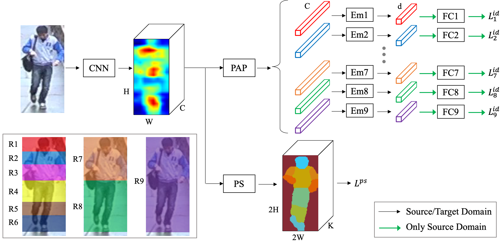

# Introduction

The code for our paper [*EANet: Enhancing Alignment for Cross-Domain Person Re-identification*](https://arxiv.org/abs/1812.11369). A Chinese version of introduction for this paper can be found [here](https://zhuanlan.zhihu.com/p/53660395).



This repository provides
- Almost all experiments, with trained models
- Used data
- Easy-to-extend framework

# Installation

- Python 2.7 (Recommend to use [Anaconda](https://www.anaconda.com/download/) for easy package management.)
- Pytorch 1.0.0
- Torchvision 0.2.1

The other packages and versions are listed in `requirements.txt`. You can install them by `pip install -r requirements.txt`.

# Dataset Structure

Prepare datasets to have following structure:
```
${project_dir}/dataset
    market1501
        Market-1501-v15.09.15                   # Extracted from Market-1501-v15.09.15.zip, http://www.liangzheng.org/Project/project_reid.html
        Market-1501-v15.09.15_ps_label
        bounding_box_train_duke_style
        im_path_to_kpt.pkl
    cuhk03_np_detected_jpg
        cuhk03-np                               # Extracted from cuhk03-np.zip, https://pan.baidu.com/s/1RNvebTccjmmj1ig-LVjw7A
        cuhk03-np-jpg_ps_label
        im_path_to_kpt.pkl
    duke
        DukeMTMC-reID                           # Extracted from DukeMTMC-reID.zip, https://github.com/layumi/DukeMTMC-reID_evaluation
        DukeMTMC-reID_ps_label
        bounding_box_train_market1501_style
        im_path_to_kpt.pkl
    msmt17
        MSMT17_V1                               # Extracted from MSMT17_V1.tar.gz, https://www.pkuvmc.com/publications/msmt17.html
        MSMT17_V1_ps_label
        im_path_to_kpt.pkl
    partial_reid
        Partial-REID_Dataset                    # Extracted from Partial-REID_Dataset.rar, http://isee.sysu.edu.cn/files/resource/Partial-REID_Dataset.rar
    partial_ilids
        Partial_iLIDS                           # Provided by https://github.com/lingxiao-he/Partial-Person-ReID
    coco
        images
        masks_7_parts
        im_name_to_kpt.pkl
        im_name_to_h_w.pkl
```
Keypoints and part segmentation labels: [Baidu Cloud](https://pan.baidu.com/s/1Mm2gWO-Xg3wiyCd6SEAWaA) or [Google Drive](https://drive.google.com/open?id=1BARSoobjTAPeOSOM-HnGzlOYTj1l9-Qs). Our keypoint model is currently not public, while [this repo](https://github.com/Microsoft/human-pose-estimation.pytorch) can be an alternative. For part segmentation, we release our code at [this repo](https://github.com/huanghoujing/PyTorch-Encoding).

### Keypoint Format

The following example shows the keypoint format.
```python
from __future__ import print_function
import cPickle
res = cPickle.load(open('dataset/market1501/im_path_to_kpt.pkl'))
# 'Market-1501-v15.09.15/bounding_box_train/0742_c1s4_014906_01.jpg' ...
print(res.keys()[:5])
# ['kpt', 'im_h_w']
print(res.values()[0].keys())
# A numpy array with shape [17, 3], for 17 keypoints. Each row is (x, y, confidence); we treat those with confidence > 0.1 as visible.
print(res.values()[0]['kpt'])
# [h, w] of the image
print(res.values()[0]['im_h_w'])
```

For COCO, there is a bit difference.
```python
from __future__ import print_function
import cPickle
res = cPickle.load(open('dataset/coco/im_name_to_kpt.pkl'))
# Currently only contain train set.
# 'COCO_train2014_000000426663_185693.jpg' ...
print(res.keys()[:5])
# A numpy array with shape [17, 3], each row is (x, y, visibility), visibility is one of [0, 1, 2], refer to COCO dataset for detail
print(res.values()[0])

# image size
res = cPickle.load(open('dataset/coco/im_name_to_h_w.pkl'))
print(res.keys()[0])
print(res.values()[0])
```


### Part Segmentation Label Format

Part segmentation label for each image is a single-channel PNG file, with same resolution as the image. Label mapping is as follows
```
{
    'background': 0,
    'head': 1,
    'torso': 2,
    'upper_arm': 3,
    'lower_arm': 4,
    'upper_leg': 5,
    'lower_leg': 6,
    'foot': 7,
}
```

# Train/Test/Inference Example

- Our trained models: [Baidu Cloud](https://pan.baidu.com/s/1Mm2gWO-Xg3wiyCd6SEAWaA) or [Google Drive](https://drive.google.com/open?id=1BARSoobjTAPeOSOM-HnGzlOYTj1l9-Qs).
- Train model `GlobalPool` on `market1501`
    ```bash
    cd ${project_dir}
    CUDA_VISIBLE_DEVICES=0 python -m package.optim.eanet_trainer --exp_dir exp/eanet/GlobalPool/market1501 --cfg_file package/config/default.py --ow_file paper_configs/GlobalPool.txt --ow_str "cfg.dataset.train.name = 'market1501'"
    ```
- Test the `GlobalPool` model that was trained on `market1501`. Make sure directory `exp_dir` exists and a `ckpt.pth` is inside it.
    ```bash
    cd ${project_dir}
    CUDA_VISIBLE_DEVICES=0 python -m package.optim.eanet_trainer --exp_dir exp/eanet/GlobalPool/market1501 --cfg_file package/config/default.py --ow_file paper_configs/GlobalPool.txt --ow_str "cfg.dataset.train.name = 'market1501'; cfg.only_test = True"
    ```
- Users can also use a trained model for inference on their own images, with or without identity labels. `script/exp/visualize_rank_list.py` takes a query image directory and a gallery directory, and then visualize the retrieving results. E.g. use PCB trained on Market1501 to perform retrieving on Market1501 query and gallery images. Make sure directory `exp_dir` exists and the `ckpt.pth` is inside it.
    ```bash
    CUDA_VISIBLE_DEVICES=0 \
    python script/exp/visualize_rank_list.py \
    --exp_dir exp/vis_rank_list_PCB_M_to_M_id_aware \
    --cfg_file package/config/default.py \
    --ow_file paper_configs/PCB.txt \
    --ow_str "cfg.only_infer = True" \
    --q_im_dir dataset/market1501/Market-1501-v15.09.15/query \
    --g_im_dir dataset/market1501/Market-1501-v15.09.15/bounding_box_test \
    --save_dir exp/vis_rank_list_PCB_M_to_M_id_aware/result \
    --id_aware true
    ```
  The result is shown in `misc/PCB_rank_list_M_to_M`.
- **(Almost) All** experiments of the paper is in `script/exp/train_all.sh`. Look at it for details.
- To test **(almost) all** models of the paper. Download and place the trained models in the following structure
    ```
    ${project_dir}/exp/eanet/test_paper_models
    ├── GlobalPool
    │   ├── cuhk03_np_detected_jpg
    │   │   └── ckpt.pth
    │   ├── duke
    │   │   └── ckpt.pth
    │   └── market1501
    │       └── ckpt.pth
    ├── PAP
    │   ├── cuhk03_np_detected_jpg
    │   │   └── ckpt.pth
    │   ├── duke
    │   │   └── ckpt.pth
    │   └── market1501
    │       └── ckpt.pth
    ├── PAP_6P
    │   ├── cuhk03_np_detected_jpg
    │   │   └── ckpt.pth
    │   ├── duke
    │   │   └── ckpt.pth
    │   └── market1501
    │       └── ckpt.pth
    ├── PAP_ST_PS
    │   ├── cuhk03_np_detected_jpg_to_duke
    │   │   └── ckpt.pth
    │   ├── cuhk03_np_detected_jpg_to_market1501
    │   │   └── ckpt.pth
    │   ├── duke_to_cuhk03_np_detected_jpg
    │   │   └── ckpt.pth
    │   ├── duke_to_market1501
    │   │   └── ckpt.pth
    │   ├── market1501_to_cuhk03_np_detected_jpg
    │   │   └── ckpt.pth
    │   └── market1501_to_duke
    │       └── ckpt.pth
    ├── PAP_ST_PS_SPGAN
    │   ├── duke_to_market1501
    │   │   └── ckpt.pth
    │   └── market1501_to_duke
    │       └── ckpt.pth
    ├── PAP_ST_PS_SPGAN_CFT
    │   ├── duke_to_market1501
    │   │   └── ckpt.pth
    │   └── market1501_to_duke
    │       └── ckpt.pth
    ├── PAP_S_PS
    │   ├── cuhk03_np_detected_jpg
    │   │   └── ckpt.pth
    │   ├── duke
    │   │   └── ckpt.pth
    │   └── market1501
    │       └── ckpt.pth
    ├── PAP_StC_PS
    │   ├── cuhk03_np_detected_jpg
    │   │   └── ckpt.pth
    │   ├── duke
    │   │   └── ckpt.pth
    │   └── market1501
    │       └── ckpt.pth
    └── PCB
        ├── cuhk03_np_detected_jpg
        │   └── ckpt.pth
        ├── duke
        │   └── ckpt.pth
        └── market1501
            └── ckpt.pth
    ```
    Then, run
    ```bash
    cd ${project_dir}
    bash script/exp/test_all.sh
    ```
    You should get the following testing scores (Refer to the paper for table format). **Note:** The original models for `PAP-ST-PS` and `PAP_ST_PS_SPGAN_CFT` are missing, so we train the models again and their scores are not identical to the paper's.
    
    |                     | M->M        | C->C        | D->D        | M->C        | M->D        | C->M        | C->D        | D->M        | D->C        |
    |---------------------|-------------|-------------|-------------|-------------|-------------|-------------|-------------|-------------|-------------|
    | GlobalPool          | 88.2 (71.3) | 42.4 (39.6) | 79.2 (61.9) | 10.7 ( 9.3) | 38.7 (21.5) | 45.7 (21.8) | 32.5 (15.7) | 47.9 (21.6) | 9.1 ( 7.7)  |
    | PCB                 | 93.2 (81.1) | 65.2 (60.0) | 86.3 (72.7) | 8.9 ( 7.8)  | 42.9 (23.8) | 52.1 (26.5) | 29.2 (15.2) | 56.5 (27.7) | 8.4 ( 6.9)  |
    | PAP-6P              | 94.4 (84.2) | 68.1 (62.4) | 85.6 (72.4) | 11.6 ( 9.9) | 47.6 (28.3) | 54.6 (29.3) | 33.9 (18.1) | 59.7 (31.4) | 9.2 ( 8.2)  |
    | PAP                 | 94.4 (84.5) | 72.0 (66.2) | 86.1 (73.3) | 11.4 ( 9.9) | 46.4 (27.9) | 55.5 (30.0) | 34.0 (17.9) | 59.5 (30.6) | 9.7 ( 8.0)  |
    | PAP-S-PS            | 94.6 (85.6) | 72.5 (66.7) | 87.5 (74.6) | 14.2 (12.8) | 51.4 (31.7) | 59.4 (33.3) | 39.3 (22.0) | 61.7 (32.8) | 11.4 ( 9.6) |
    | PAP-StC-PS          | 94.7 (84.9) | 70.1 (64.4) | 87.0 (73.4) | 19.1 (16.4) | 56.3 (35.1) | 65.5 (38.6) | 45.2 (26.1) | 65.2 (35.7) | 12.2 (10.5) |
    | PAP-ST-PS           | -           | -           | -           | 22.4 (19.5) | 55.3 (35.7) | 67.8 (40.7) | 43.9 (25.9) | 66.5 (36.6) | 15.1 (13.4) |
    | PAP-ST-PS-SPGAN     | -           | -           | -           | -           | 61.4 (39.4) | -           | -           | 69.6 (39.3) | -           |
    | PAP-ST-PS-SPGAN-CFT | -           | -           | -           | -           | 67.0 (47.0) | -           | -           | 76.4 (50.3) | -           |


# Code Explanation

### Training

The training logic is defined in `package/optim/eanet_trainer.py` and `package/optim/cft_trainer.py`, the latter for *Clustering and Finetuning*. A training command looks like
```bash
cd ${project_dir}
CUDA_VISIBLE_DEVICES=0 python -m package.optim.${trainer} --exp_dir ${exp_dir} --cfg_file ${cfg_file} [--ow_file ${ow_file}] [--ow_str ${ow_str}]
```
- `${trainer}` is one of `eanet_trainer` or `cft_trainer`.
- `${exp_dir}` is the directory for experiment output.
- `${cfg_file}` is a file defining configurations. Look at `package/config/default.py` for an example.
- [Optional] `${ow_file}` is a text file defining configurations to overwrite your `${cfg_file}`.
- [Optional] `${ow_str}` is a string defining configurations to overwrite your `${cfg_file}`.
- `${ow_file}` is mainly for storing the configurations used in the paper. Look at `paper_configs/*.txt` for details.
- `${ow_str}` is a handy way to modify some settings in command line without manually modify the config file. This is convenient, e.g. when running the same model on many datasets.
- The code will copy `${cfg_file}` into `${exp_dir}`, and then overwrite the items specified in `${ow_file}` (if provided) and then those in `${ow_str}` (if provided).

### Testing

Test sets and testing interval can be set in config file, and the training script will test the model during training. If you want to test a trained model, create a `exp_dir` and place the `ckpt.pth` inside it, then set `cfg.only_test = True` in `${config_file}` and run `package/optim/eanet_trainer.py`. In this case, the code only performs testing. 

### Inference

To use a trained model for inference (extracting feature), the overall logic is
1. Create a `exp_dir` and place the `ckpt.pth` inside it
2. Set `cfg.only_infer = True`
3. `trainer = EANetTrainer()`, then try `trainer.infer_one_im` or `trainer.infer_im_list` or `trainer.infer_dataloader`, which is flexible.

**NOTE:** Our model inference (feature extractor) can be used as an API, not just run in command line. For example, if you want to use PCB feature extractor trained on Market1501 in another project, you can add our package path to `$PYTHONPATH`. Then in your project, do something like this
```python
from package.optim.eanet_trainer import EANetTrainer
from package.eval.np_distance import compute_dist
from easydict import EasyDict

args = EasyDict()
args.exp_dir = 'exp/try_pcb_trained_on_market1501_for_reid_feature'  # There should be the corresponding `ckpt.pth` in it
args.cfg_file = '${EANet_PROJECT_DIR}/package/config/default.py'  # Set this `${EANet_PROJECT_DIR}`
args.ow_file = '${EANet_PROJECT_DIR}/paper_configs/PCB.txt'  # Set this `${EANet_PROJECT_DIR}`
args.ow_str = "cfg.only_infer = True"

eanet_trainer = EANetTrainer(args=args)
feature_dict1 = eanet_trainer.infer_one_im(im_path='YOUR/IMAGE/PATH/1.jpg', squeeze=False)  # You can also provide PIL Image instead of image path
feature_dict2 = eanet_trainer.infer_one_im(im_path='YOUR/IMAGE/PATH/2.jpg', squeeze=False)  # You can also provide PIL Image instead of image path
cosine_distance = compute_dist(feature_dict1['feat'], feature_dict2['feat'])[0][0]
```

**NOTE:** For your own images, if you want to perform Part Aligned Pooling for inference, you have to provide keypoint generated `pap_mask`. Though, as alternatives you can use GlobalPool or PCB, which also achieve satisfactory performance in our implementation.

For details of inference, refer to `package/optim/reid_trainer.py`.

### Extension: Dataset

Current datasets
- Market1501
- CUHK03-NP *detected* Subset
- DukeMTMC-reID
- MSMT17
- Partial-REID
- Partial-iLIDs

You can create new dataset class in `package/data/datasets/` and then register it in `package/data/create_dataset.py`.

### Extension: Model

Current backbone is ResNet. You can implement new backbones and then register them in `package/model/backbone.py`. Or you can re-define the whole model `package/model/model.py`, as long as you implement the methods declared in `package/model/base_model.py`.

**Note:** If you re-implement the whole model, you may have to modify the `model.forward()` logic in following files as well
- `package/optim/eanet_trainer.py`
- `package/optim/cft_trainer.py`
- `package/eval/extract_feat.py`

This model calling can be abstracted away in the future.

### Extension: Training

`package/optim/reid_trainer.py` covers the common logic for ReID training, with some abstraction to be implemented by sub classes. `package/optim/eanet_trainer.py` and  `package/optim/cft_trainer.py` are concrete implementations, which also demonstrate the usage of hybrid batches and multi losses, etc.

### Design Logic

We heavily use `dict` for passing data / configuration arguments when calling functions. This simplifies function headers and reduces the amount of code to modify when changing experiment settings.

# TODO

- More datasets
- More backbones
- Run TripletLoss
- Run warmup
- Test TensorBoard
- Implement `forward_type == 'ps_reid_serial'`
- Write commit num to log
- Debug why it prints
    ```
    Loaded pickle file dataset/market1501/im_path_to_kpt.pkl
    Loaded pickle file dataset/market1501/im_path_to_kpt.pkl
    ```
    at the beginning of every epoch?

# Misc

- Tricky! `EasyDict.__setattr__` will transform tuple into list! So don't rely on it to store tuples! You have to transform them into tuples wherever tuple is needed.
- If you meet error `ImportError: /lib64/libstdc++.so.6: version CXXABI_1.3.9 not found (required by ${Anaconda}/lib/python2.7/site-packages/scipy/sparse/_sparsetools.so)`, try `conda install libgcc; export LD_LIBRARY_PATH=${YOUR_ANACONDA_HOME}/lib:${LD_LIBRARY_PATH}`
- The CUHK03 dataset provides image data in `.mat` format. [open-reid](https://github.com/Cysu/open-reid/) transforms it to JPG images, while CUHK03-NP provides PNG images. Throughout the paper, we use JPG version of CUHK03-NP, due to some historical reasons. After the paper, we find that CUHK03-NP PNG has better performance than JPG on the GlobalPool baseline; We did not perform further experiments on other model architectures, due to time limitation.

# Citation

If you find our work useful, please kindly cite our paper:
```
@article{huang2018eanet,
  title={EANet: Enhancing Alignment for Cross-Domain Person Re-identification},
  author={Huang, Houjing and Yang, Wenjie and Chen, Xiaotang and Zhao, Xin and Huang, Kaiqi and Lin, Jinbin and Huang, Guan and Du, Dalong},
  journal={arXiv preprint arXiv:1812.11369},
  year={2018}
}
```